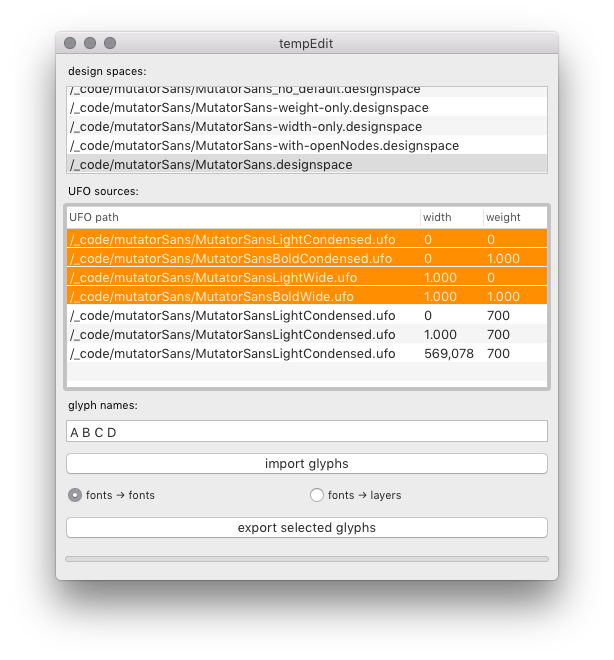
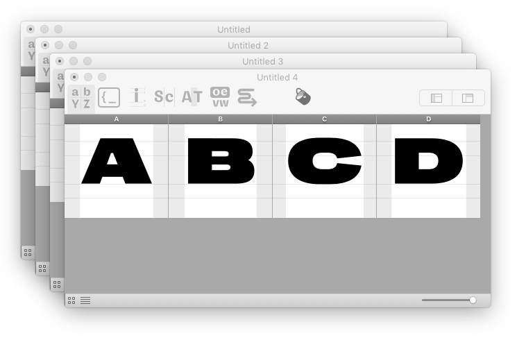
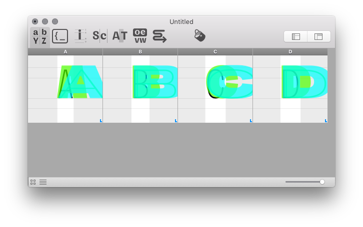

tempEdit
========

A tool for importing glyphs from `.designspace` sources into a temporary font for editing, and saving them back into their source UFOs when done.

Problem
-------

- dealing with large designspaces containing several masters
- each master contains hundreds of glyphs each
- need to have several masters open at once in the 
UI for editing
- refreshing the Font Collection is a performance bottleneck, RF gets slow

see [What computer performance metrics are most relevant to RF performance?](http://forum.robofont.com/topic/672/what-computer-performance-metrics-are-most-relevant-to-rf-performance)

Solution
--------

- avoid opening several large fonts in the UI!
- treat full UFOs as a “database”, work with partial fonts instead
- open only glyphs that need to be edited in the UI using temporary fonts
- after the glyphs have been edited, save them back into their original fonts

Usage
-----

1. Drag and drop one or more `.designspace` files from Finder into the *designspaces* list (top).

2. Select a designspace file to refresh the *UFO sources* list with all masters used in the designspace.

3. Define a list with names of glyphs you wish to import for editing.

4. Click on the *import* button to import glyphs into a temporary font.

    Choose *fonts → fonts* to import each source into a separate font: 

    

    Choose *fonts → layers* to import sources as layers of a single font:

    

5. Make changes, then use the *export* button to save the selected glyphs back into their source fonts.

